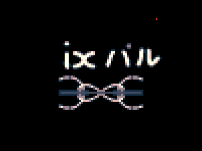
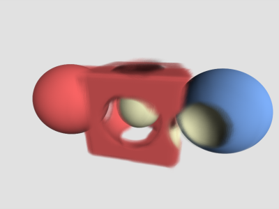
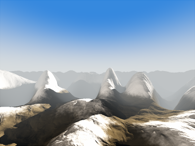

Graphical and Numerical Prototyping Kit
=======================================

Demo
====
 * lines.cpp - Line API - Phase portrait of nonlinear dynamic differential equation

 
 * particles.cpp - SIMD and shadow mapping

 
 * idxpal.cpp - 4xSupersampled pixel art tool

 

 

 

Todo
====
 * stb_truetype
 * #include in shader
 * Easy uniform manipulation using imgui and in-shader parameter declaration
 * Default good-looking pipeline
    - Sky shader (procedural)
    - Cubemap env. map
    - PBS materials loaded from standardized mesh format
    - Compute bounding boxes of loaded mesh
    - Compute maximum bounds (normalization factor)
    - Mean model bound (also a normalization factor)
    - Compute centroid
 * SIMD particles
    * http://i-saint.hatenablog.com/entry/2015/05/26/212441
 * SIMD noise
 * Extend math lib, orthovec, transpose, ...
 * Attitude control using quaternions
    * http://www.3dgep.com/understanding-quaternions/
 * FPS camera
 * Scene
 * Spline camera, follow given set of control points

 * Upgrade imgui. Detect when gui panel is active/hovered, and disable i.e. fps camera from moving.
